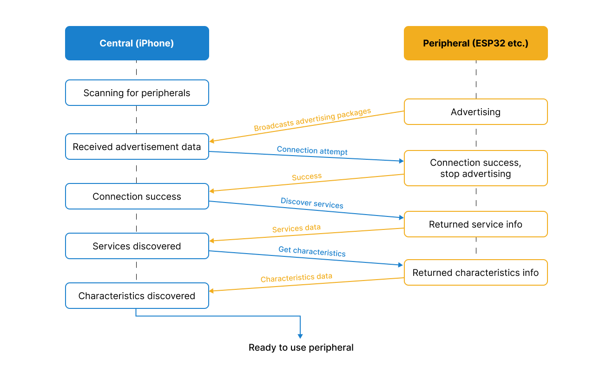

# Managing Bluetooth Low Energy (BLE) Connections in Swift Using CoreBluetooth
[](https://www.youtube.com/embed/-qCLrqII1bs?si=Fkz9imGx4UmX1UlG)

This Swift project demonstrates how to manage Bluetooth Low Energy (BLE) connections with ESP32 devices using ```CoreBluetooth``` framework. The application allows for discovering, connecting to, and communicating with ESP32 peripherals.

## Overview
The project for setting up advertising, characteristics and initializing the BLE server can be found here - https://github.com/ArtsemiR/ESP32-BLE-Remote-Control-Demo

The scheme represents a simplified flow of how a central device, such as an iPhone, interacts with a peripheral device through Bluetooth Low Energy (BLE):
1. The iPhone starts looking for BLE devices nearby.
2. The peripheral is broadcasting a signal to announce its presence to devices like the iPhone.
3. The iPhone picks up this signal, learning that the peripheral is available to connect.
4. The iPhone successfully connects to the peripheral, which then stops broadcasting since it's no longer just advertising but is now connected.
5. The iPhone asks the peripheral to list its services.
6. The peripheral sends back information about the services it offers.
7. The iPhone requests the details of these services, referred to as "characteristics"
8. The peripheral provides this detailed characteristics information.
9. With all the necessary information exchanged, the iPhone is now ready to interact with the ESP32 for its intended use.

## Configuration

### Info.plist

The `Info.plist` file is configured to request Bluetooth usage permission from the user:

```xml
<plist version="1.0">
<dict>
    <key>NSBluetoothAlwaysUsageDescription</key>
    <string>This app uses Bluetooth to connect and control ESP32 devices.</string>
</dict>
</plist>
```
This setting is required for iOS apps that use Bluetooth features, ensuring the app complies with Apple's privacy guidelines.


### BLEManager.swift
#### Peripheral Structure
The Peripheral struct encapsulates data for a BLE device, including its UUID, name, RSSI (signal strength), advertised services, and a reference to CBPeripheral.

```swift
struct Peripheral: Identifiable {
    let id: UUID
    let name: String
    let rssi: Int
    let advertisementServiceUUIDs: [String]?
    let peripheral: CBPeripheral
}
```

#### BLEManager Class
The ```BLEManager``` class is designed to work within a SwiftUI context, conforming to ObservableObject for UI updates. Additionally, it implements ```CBCentralManagerDelegate``` and ```CBPeripheralDelegate``` protocols to manage BLE connections.

ESP32 **Identifiers** determined during programming of this repo - https://github.com/ArtsemiR/ESP32-BLE-Remote-Control-Demo
```swift
class BLEManager: NSObject, ObservableObject, CBCentralManagerDelegate, CBPeripheralDelegate {
    // UUIDs for ESP32 BLE service and characteristic.
    enum ESP32Constants {
        static let serviceUUID = "4fafc201-1fb5-459e-8fcc-c5c9c331914b"
        static let characteristicUUID = "beb5483e-36e1-4688-b7f5-ea07361b26a8"
    }

    var centralManager: CBCentralManager!
    var esp32Peripheral: CBPeripheral?
    var esp32Characteristic: CBCharacteristic?

    @Published var peripherals: [Peripheral] = []
    @Published var isConnected = false // Indicates if the app is connected to a peripheral.
    @Published var bootButtonState = false // Tracks the state of the BOOT button.

    // Function implementations...
}
```

#### Setting Up the Central Manager
```swift
override init() {
    super.init()
    centralManager = CBCentralManager(delegate: self, queue: nil)
}
```
**Key Function**: Initializes the BLEManager and sets up the central manager, which is responsible for managing BLE connections.\
**Working Principle**: When an instance of BLEManager is created, it automatically creates a CBCentralManager. This central manager is crucial for any BLE operation, as it scans for, connects to, and manages data exchange with BLE peripherals.

### Central Manager Delegate Methods

```swift
func centralManagerDidUpdateState(_ central: CBCentralManager)
```
>**Key Function** Responds to changes in the BLE hardware state.\
>**Working Principle**: Automatically invoked whenever the state of the central manager changes (e.g., when Bluetooth is turned on or off). It’s essential for monitoring the readiness of the device’s BLE hardware.

```swift
func centralManager(_ central: CBCentralManager, didDiscover peripheral: CBPeripheral, advertisementData: [String: Any], rssi RSSI: NSNumber)
```
>**Key Function**: Handles the discovery of BLE peripherals.\
>**Working Principle**: Called each time the central manager discovers a BLE peripheral while scanning. It filters and adds ESP32 devices to the list of peripherals, making them available for connection.

```swift
func centralManager(_ central: CBCentralManager, didConnect peripheral: CBPeripheral)
```
>**Key Function**: Manages actions after successfully connecting to a peripheral.\
>**Working Principle**: Triggered when a connection is successfully established. It's used to start the discovery of services provided by the peripheral, marking the beginning of detailed communication.

```swift
func centralManager(_ central: CBCentralManager, didDisconnectPeripheral peripheral: CBPeripheral, error: Error?)
```
>**Key Function**: Handles the peripheral disconnection process.\
>**Working Principle**: Invoked when the peripheral is disconnected, either intentionally or due to an error. It resets the connection state and can trigger a re-scan for devices.

### Peripheral Delegate Methods

```swift
func peripheral(_ peripheral: CBPeripheral, didDiscoverServices error: Error?)
```
>**Key Function**: Identifies services provided by the peripheral.\
>**Working Principle**: Called after services of the connected peripheral are discovered. This function initiates the discovery of characteristics, which are specific capabilities or data points of the BLE service.

```swift
func peripheral(_ peripheral: CBPeripheral, didDiscoverCharacteristicsFor service: CBService, error: Error?)
```
>**Key Function**: Discovers the characteristics of a service.\
>**Working Principle**: Once services are identified, this function looks for their characteristics. It's crucial for finding the right channel to send or receive data from the BLE device.

```swift
func peripheral(_ peripheral: CBPeripheral, didUpdateValueFor characteristic: CBCharacteristic, error: Error?)
```
>**Key Function**: Handles updates to the characteristics’ values.\
>**Working Principle**: Notified when there’s new data from the peripheral. This is where the app can process incoming data, such as sensor readings or status updates from the BLE device.

```swift
func peripheral(_ peripheral: CBPeripheral, didWriteValueFor characteristic: CBCharacteristic, error: Error?)
```
>**Key Function**: Confirms that data was successfully written to a characteristic.\
>**Working Principle**: Called when a write operation to the peripheral’s characteristic is completed. It's useful for confirming that the data sent to the BLE device was received and processed.
